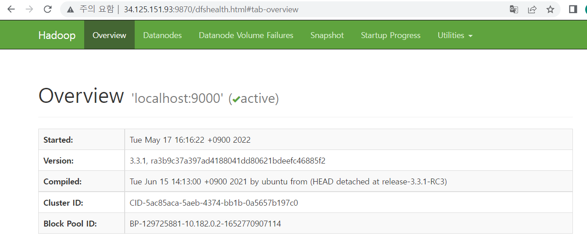
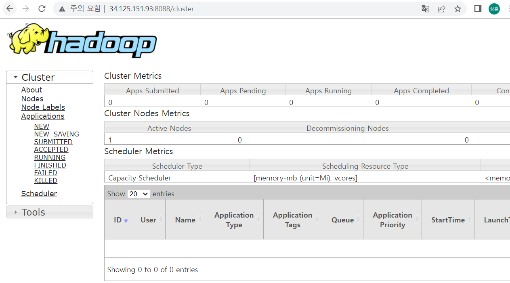

### 하둡

- 대용량 자료를 처리할 수 있는 컴퓨터 클러스터에서 동작하는 분산 응용 프로그램을 지원하는 오픈소스 프레임워크

- 분산 데이터 처리 기술: 큰 용량의 단일 서버보다 여러 서버의 작은 용량을 묶은 컴퓨터 클러스터로 구성

---
# HDFS

- hdfs는 Java로 작성된 Google의 GFS 기반 파일 시스템이다. 기존의 파일시스템(ex3, ex4, xfs)의 상위에서 동작하게된다.

```
client 

-> rpc

region servers
filesystem
local, HDFS, S3(AWS)

-> xceiver

DataNode
OS
On-Disk Filesystem
Disk driver

-> Disk
```

HDFS 파일 저장방식
1) File은 block 단위로 분할됩니다. (각 block은 기본적으로 64MB 또는 128MB 크기)
 - 만약 데이터가 180M라면 (64+64+64 총 3개의 블럭에 나눠 들어가게 됨)

2) 데이터가 로드 될 때 여러 machine에 분산되어 저장된다.
- 같은 파일의 다른 블록들은 서로 다른 machine에 저장됨
- 이를 통해 효율적인 `Map Reduce` 처리가 가능
- 블록들은 여러 machine에 복제되어 데이터 노드에 저장된다.
    - 기본 `replication`은 3개이다. (각 블록들이 3개의 서로다른 기계에 저장됨)
 - 네임 노드로 불리는 마스터 노드는 어떤 블록들이 파일을 구성하고 있고, 어느 위치에 저장되어 있는지에 대한정보를 메타데이터로 관리한다.

- 데이터 파일들은 블록으로 분할되고, 데이터 노드에 분산되어 저장한다. 각 block은 여러 노드에 복제되어 저장된다. 

- metadata
    - 데이터에 대한 데이터를 의미
    - 파일 블록 정보를 저장
        - 데이터가 어떤 컴퓨터에 저장되어있는지

- 파일이 64MB, 128MB의 블록으로 분할될 때 파일이 블록의 크기보다 작은 경우, 블록 크기 전체를 사용하지않게된다. 
    - Block들은 hadoop configuration에 설정된 디렉터리를 통해 저장된다. 네임노드의 메타데이터를 사용하지 않으면 HDFS에 접근할 수 있는 방법이 존재하지 않는다.

- 클라이언트 애플리에키션이 파일에 접근하는 경우
    - 네임노드와 통신하여 파일을 구성하고 있는 블록들의 정보와 데이터노드의 블록 위치 정보를 제공받는다.
    - 이후 데이터를 읽기 위해 데이터노드와 직접 통신을 하게 된다.
    - 결과적으로 읽기 작업만 일어나는 네임노드는 `bottleneck`이 되지 않는다.

---

### HDFS 접근방식
- hdfs 접근하는 방법에는 shell 커맨드라인을사용 HTTP
- Java API
- ecosystem 프로젝트를 사용하는 방법
    - `Flume`(네트워크 소스로부터 데이터 수집)
    - `Sqoop`(HDFS와 RDBMS 사이의 데이터 전송)
    - `Hue`(Web 기반의 인터페이스 UI)

----

HDFS 파일 저장과 조회

- 네임노드의 메타데이터 정보를 통해 어떤 로그 파일이 어떤 블록에 존재하는것을 확인할 수 있다.

---

### HDFS 네임노드 가용성

- 네임노드의 데몬은 반드시 항상 실행되고 있어야 한다.
- 만약 네임노드가 중단되면, 클러스터는 접근이 불가능하다. 

- 고가용성 모드 2개의 네임노드를 구성하기도 한다.
    `Active` , `Stanby`
- 일반적인 클래식모드에서는 1개의 네임노드와 또 다른 helper 노드인 `SecondaryNameNode`로 구성된다.
- 이 때 helper 노드는 백업 목적이 아니다.
- 네임노드를 복원할 수 있는 정보를 가지는 PC이다.
- 장애 발생 시 `NameNode`를 대신하는 것이 불가능하다.

---
### Hadoop의 구성요소

`client`: Name Node를 통해 정보를 받고 이후 직접적으로 Data Node와 통신을 한다.

`Master Node` : 물리적으로 Master Node 역할(Job tracker, Name Node)을 하는 노드로서, slave Node에 대한 정보와 실행을 할 Task에 대한 관리를 담당한다.

`Slave Node` : 물리적으로 Slave Node 역할(Data Node, Task Node)을 하는 노드로서, 실제로 데이터를 분산되어가지고 있으며 Client에서 요청이 오면 데이터를 전달하는 역할 및 담당 Task를 수행하는 역할을 합니다.

---

Data Analytics 관점
Job Tracker: 노드에 Task를 할당하는 역할과 모든 Task를 모니터링하고 실패할 경우 Task를 재실행하는 역할.
Task Tracker: Task는 Map Task와 Reduce Task로 나눠질 수 있으며, Task가 위치한 HDFS의 데이터를 사용하여 MapReduce를 수행.

Data Storage 관점
Name Node: HDFS의 파일 및 디렉터리에 대한 메타 데이터를 유지. 클라이언트로 부터 데이터 위치 요청이 오면 전달, 장애 손상시 Secondary Node로 대체
Data Node: 데이터를 HDFS의 Block 단위로 구성. Fault Recovery를 위해 default로 3 copy를 유지, Heartbeat를 통하여 지속적으로 파일 위치 전달.

---

### 하둡 설치 

- JDK 설치
```
$ sudo apt-get update
$ sudo apt-get install openjdk-11-jdk
```

```
# ~/.bash_profile

if [ -f ~/.bashrc ]; then
        . ~/.bashrc
fi

# JAVA_HOME 추가하기
export JAVA_HOME=/usr/lib/jvm/java-11-openjdk-amd64
export PATH=$PATH:$JAVA_HOME/bin

$ cat ~/.bash_profile 
if [ -f ~/.bashrc ]; then
        . ~/.bashrc
fi

export JAVA_HOME=/usr/lib/jvm/java-11-openjdk-amd64
export PATH=$PATH:$JAVA_HOME/bin

$ echo $JAVA_HOME
/usr/lib/jvm/java-11-openjdk-amd64
$ echo $PATH
/usr/local/bin:/usr/bin:/bin:/usr/local/games:/usr/games:/usr/lib/jvm/java-11-openjdk-amd64/bin

```

```
source ~/.bash_profile
```

```
$ java -version
openjdk version "11.0.15" 2022-04-19
OpenJDK Runtime Environment (build 11.0.15+10-post-Debian-1deb10u1)
OpenJDK 64-Bit Server VM (build 11.0.15+10-post-Debian-1deb10u1, mixed mode, sharing)
```

- hadoop 다운로드 파일
https://downloads.apache.org/hadoop/common/hadoop-3.3.1/

```
$ wget https://downloads.apache.org/hadoop/common/hadoop-3.3.1/hadoop-3.3.1.tar.gz
```

```
압축해제

# tar -zxvf hadoop-3.3.1.tar.gz

디렉터리 이동

# mv hadoop-3.3.1 /usr/local

환경변수 설정

# vi ~/.bash_profile

# 추가

export HADOOP_HOME=/usr/local/hadoop-3.3.1

# 수정

export PATH=$PATH:JAVA_HOME/bin:$HADOOP_HOME/bin:$HADOOP_HOME/sbin:$HADOOP_HOME/bin

export HADOOP_HOME=/usr/local/hadoop-3.3.1
export HADOOP_CONF_DIR=${HADOOP_HOME}/etc/hadoop
export PATH=$PATH:JAVA_HOME/bin:$HADOOP_HOME/bin:$HADOOP_HOME/sbin:$HADOOP_HOME/bin

$echo $HADOOP_HOME
/usr/local/hadoop-3.3.1
$ echo $HADOOP_CONF_DIR
/usr/local/hadoop-3.3.1/etc/hadoop
```

- 설정파일 수정 `core-site.xml`
```
ithingvvv@instance-1:/usr/local/hadoop-3.3.1/etc/hadoop$

vi core-site.xml

ithingvvv@instance-1:/usr/local/hadoop-3.3.1/etc/hadoop$ cat core-site.xml 

<configuration>
        <property>
                <name>fs.defaultFS</name>
                <value>hdfs://localhost:9000</value>
        </property>
</configuration>
```

- 설정파일 수정 `hdfs-site.xml`

```
<configuration>
        <property> 
                <name>dfs.replication</name> 
                <value>1</value> 
        </property>
</configuration>
```

- 

```
ssh key 생성 및 저장

$ ssh-keygen -t rsa -P '' -f ~/.ssh/id_rsa
$ cat ~/.ssh/id_rsa.pub >> ~/.ssh/authorized_keys
$ chmod 0600 ~/.ssh/authorized_keys
```

- JAVA_HOME 찾을 수 없는 에러
https://nirsa.tistory.com/114

네임노드 데몬 실행

```
$ vi /usr/local/hadoop-3.3.1/etc/hadoop/hadoop-env.sh
$ /usr/local/hadoop-3.3.1/sbin/start-dfs.sh

Starting namenodes on [localhost]
Starting datanodes
Starting secondary namenodes [instance-1]

$ jps
11280 DataNode
11186 NameNode
11448 SecondaryNameNode
11593 Jps
```

- 외부 IP로 Compute Engine 접속



- YARN 데몬 실행

```
ithingvvv@instance-1:/usr/local/hadoop-3.3.1/etc/hadoop$ cd ..
ithingvvv@instance-1:/usr/local/hadoop-3.3.1/etc$ cd ..
ithingvvv@instance-1:/usr/local/hadoop-3.3.1$ sbin/start-yarn.sh 
Starting resourcemanager
Starting nodemanagers
ithingvvv@instance-1:/usr/local/hadoop-3.3.1$ jps
11280 DataNode
12001 NodeManager
11186 NameNode
11910 ResourceManager
11448 SecondaryNameNode
12331 Jps
```



---

- 하둡 버전 확인
```
ithingvvv@instance-1:/usr/local/hadoop-3.3.1$ hadoop version
Hadoop 3.3.1
Source code repository https://github.com/apache/hadoop.git -r a3b9c37a397ad4188041dd80621bdeefc46885f2
Compiled by ubuntu on 2021-06-15T05:13Z
Compiled with protoc 3.7.1
From source with checksum 88a4ddb2299aca054416d6b7f81ca55
This command was run using /usr/local/hadoop-3.3.1/share/hadoop/common/hadoop-common-3.3.1.jar
```

- HDFS 


```

# tmp 폴더 생성 
hadoop fs -mkdir /tmp

hadoop fs -mkdir /tmp/hive

hadoop fs -mkdir /user
hadoop fs -mkdir /user/hive
hadoop fs -mkdir /user/hive/warehouse

hadoop fs -ls /

```

- ls 

```
hadoop fs -ls -R /
```


- put

```
hadoop fs -mkdir -p "/user/hoon/hadoop/test"

hadoop fs -put LICENSE.txt /user/hoon/hadoop/test/

hadoop fs -ls -h /user/hoon/hadoop/test/
```

- copyFromLocal

- hadoop fs -copyFromLocal <localsrc> <hdfs destination>

```
hadoop fs -copyFromLocal ~/test /copytest
hadoop fs -cat /copytest
```

- get
- hadoop fs -get <src> <localdest>
```
hadoop fs -get /testfile ~/copyfromhadoop
```


- copyToLocal

hadoop fs -copyToLocal <hdfs source> <localdst>

```
hadoop fs -copyToLocal /sample ~/copysample
```

- cat

```
hadoop fs -cat /sample
```

- mv

```
hadoop fs -mv <src> <dest>
```

- cp

```
hadoop fs -ls /dataflair
```

- moveFromLocal

```
hadoop fs -moveFromLocal ~/test /
```

- tail

```
hadoop fs -tail /test
```

- rm
```
hadoop fs -ls /
```

- chown
```
hadoop fs -chown 
```

